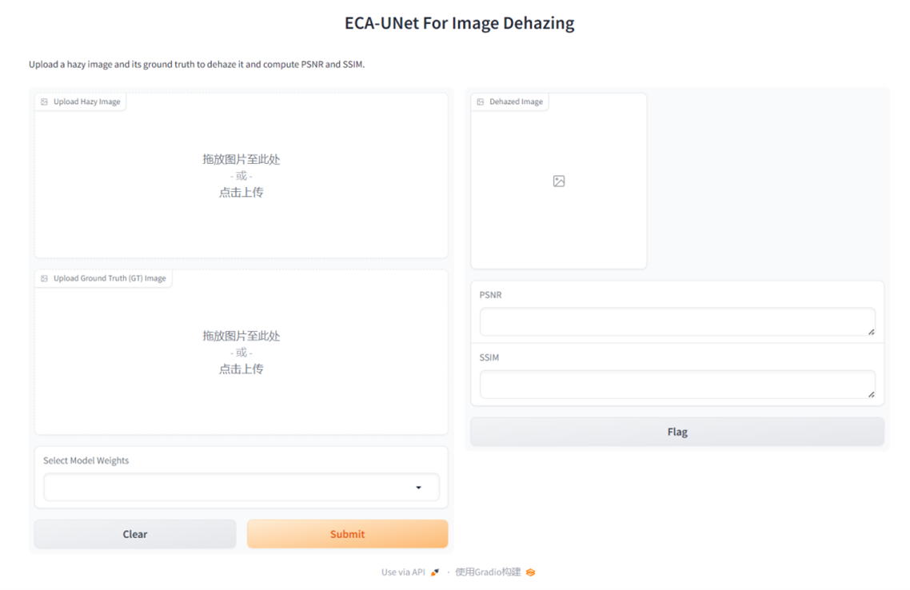
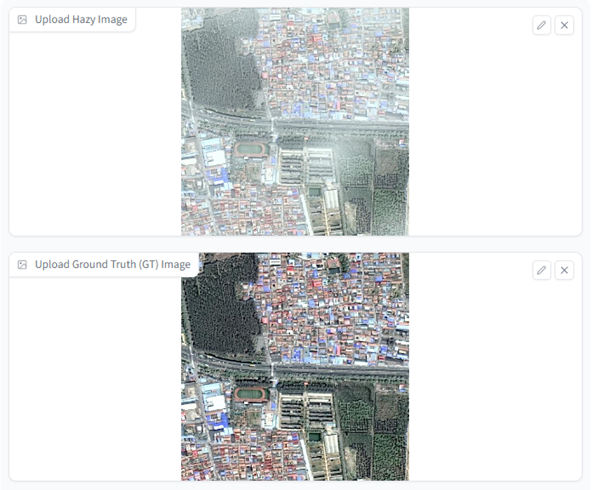
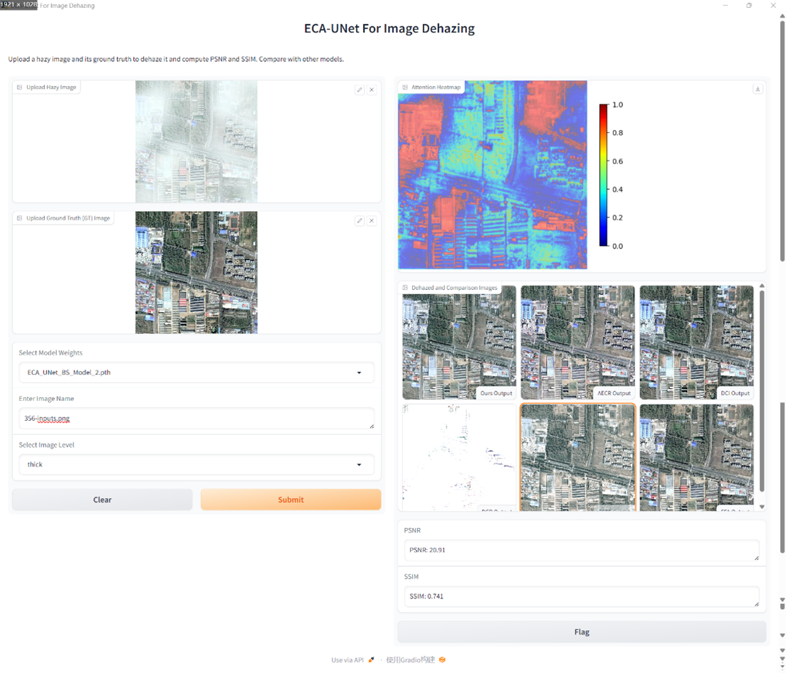

# ECA-UNet for Image Dehazing

This repository contains the code for mu undergraduate graduation project "ECA-UNet: A Simple Model for Image Dehazing"

## Introduction

This project is a simple model for image dehazing. The model is based on the U-Net architecture with the ECA module. The model is trained on the Haze1K dataset and the model is evaluated using the PSNR and SSIM metrics.

## Requirements

The following is my experimental environment, which does not represent the minimum requirements for the experimental environment

- python 3.12.4
- pyTorch 2.5.1
- torchvision 0.20.1
- cuda 12.4
- anaconda
- ...

## Usage

Download the repository and Haze1K dataset, and change the configuration in the `config.py` file.

Then, run the `train.py` to train the model.

During the training process, the `last` and the `best` models will be saved in the `weights` folder.

If you want to evaluate the model metrics, run the `evaluate.py` file.

## Results

In order to better show our experimental results, we train on the Haze1K dataset and test on the test set. We use PSNR and SSIM as evaluation metrics. In order to show the superiority of our model, we also compare with other models. Second, to verify the effectiveness of our work, we also conduct ablation experiments.

[//]: # (The following table shows the results of our model and other models on the Haze1K dataset.)

[//]: # (![compare_data.png]&#40;imgs/compare_data.png&#41;)

Comparing the results on Haze1K thin fog images.

Comparing the results on Haze1K moderate fog images.

Comparing the results on Haze1K thick fog images.

## Visualize

Use the Gradio framework to create a visual interface for the model

Interface overview

Upload the original fog image and the corresponding real fog free image

System generated result

